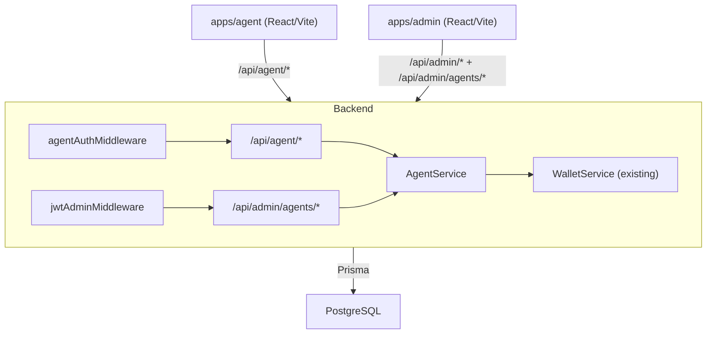

# Design Document: Agent/Cashier Role

## Overview

This feature adds an **Agent/Cashier** role to the Beteseb Bingo platform. Agents are human operators (shop owners, kiosk workers, local representatives) who act as physical cash intermediaries between players and the platform. They top up player wallets in exchange for cash collected in person, earn commissions on each top-up, and operate through a dedicated web interface (`apps/agent`).

The design spans three layers:
1. **Backend** — new Prisma models, a dedicated agent auth middleware, and `/api/agent/*` route group
2. **Admin Panel extension** — an "Agents" section restricted to `super_admin` users
3. **Agent Panel** — a new `apps/agent` React/Vite app mirroring `apps/admin` in structure

---

## Architecture



### Key Design Decisions

- **Separate JWT claim** — Agent tokens carry `{ agentId, role: "agent" }`, admin tokens carry `{ adminId, role }`. The existing `jwtAdminMiddleware` already checks `adminId`; agent middleware checks `agentId`. Each middleware explicitly rejects the other's tokens, satisfying Requirement 9.
- **Dedicated `Agent` Prisma model** — Agents are not a role on `Admin`; they have different fields (phone, commission_rate, commission_balance). This avoids polluting the `Admin` model and keeps access control clean.
- **Atomic top-up transaction** — Player wallet credit and agent commission credit happen in a single Prisma `$transaction`, satisfying Requirement 3.6.
- **New `apps/agent` app** — Mirrors `apps/admin` structure (Vite + React + react-router-dom). Agents never touch the admin panel.

---

## Components and Interfaces

### Backend

#### New Prisma Models (see Data Models)
- `Agent`
- `AgentTransaction` (audit log of top-ups performed by agents)

#### New `TxType` enum value
- `agent_top_up` — added to the existing `TxType` enum in schema and shared types

#### Middleware
- `agentAuthMiddleware` — mirrors `jwtAdminMiddleware` but reads `agentId` from token payload. Rejects tokens without `agentId` or with `role !== "agent"`. Returns 401 on missing/invalid token, 403 on wrong role type.
- `requireAgentNotOnAdmin` (inline check in `jwtAdminMiddleware`) — rejects any token carrying `role: "agent"` on `/api/admin/*` routes with 403.

#### Route Groups

**`/api/agent/auth`** (public)
- `POST /login` — agent login, returns JWT

**`/api/agent/`** (protected by `agentAuthMiddleware`)
- `GET /me` — agent profile + commission balance
- `GET /players/lookup?q=<username|phone>` — player lookup (Req 6)
- `POST /topup` — top up player wallet (Req 3)
- `GET /transactions` — paginated top-up history (Req 4)
- `GET /summary` — today's count + all-time commission (Req 4.3)

**`/api/admin/agents/`** (protected by `jwtAdminMiddleware` + `requireSuperAdmin`)
- `GET /` — list all agents (Req 1.4)
- `POST /` — create agent (Req 1.2)
- `PATCH /:id/deactivate` — deactivate agent (Req 1.5)
- `PATCH /:id/reactivate` — reactivate agent (Req 1.5)
- `PATCH /:id/commission-rate` — update commission rate (Req 1.6)
- `POST /:id/reset-commission` — reset commission balance (Req 5.3)

#### Service: `AgentService`

```typescript
interface AgentService {
  createAgent(data: CreateAgentInput): Promise<Agent>
  listAgents(): Promise<AgentWithBalance[]>
  deactivateAgent(id: string): Promise<void>
  reactivateAgent(id: string): Promise<void>
  updateCommissionRate(id: string, rate: number): Promise<void>
  resetCommissionBalance(id: string, adminId: string): Promise<void>
  login(username: string, password: string): Promise<{ token: string; agentId: string }>
  topUp(agentId: string, playerIdentifier: string, amount: number): Promise<TopUpResult>
  getTransactionHistory(agentId: string, page: number): Promise<PaginatedResponse<AgentTxRecord>>
  getSummary(agentId: string): Promise<AgentSummary>
  lookupPlayer(query: string): Promise<PlayerLookupResult>
}
```

### Frontend — `apps/agent`

Structure mirrors `apps/admin`:

```
apps/agent/
  src/
    components/
      Layout.tsx          # sidebar nav: Dashboard, Top-Up, History
      ProtectedRoute.tsx
    lib/
      api.ts              # agentApiRequest + typed endpoint functions
    pages/
      LoginPage.tsx
      DashboardPage.tsx   # commission balance + today's top-up count
      TopUpPage.tsx       # player search + amount entry + confirmation
      HistoryPage.tsx     # paginated top-up list
    main.tsx
  index.html
  package.json
  vite.config.ts
  tsconfig.json
```

### Frontend — `apps/admin` extension

A new `AgentsPage.tsx` added to the admin panel, visible only when `adminRole === "super_admin"`. The `Layout.tsx` nav conditionally renders the "Agents" link based on role read from `localStorage`.

---

## Data Models

### Schema additions

```prisma
// New enum value added to TxType
enum TxType {
  // ... existing values ...
  agent_top_up
}

model Agent {
  id                   String   @id @default(uuid())
  username             String   @unique
  password_hash        String
  phone                String?
  is_active            Boolean  @default(true)
  commission_rate      Float    @default(0)   // percentage e.g. 5.0 = 5%
  commission_balance   Decimal  @default(0)   @db.Decimal(14, 2)
  created_at           DateTime @default(now())
  updated_at           DateTime @updatedAt

  transactions AgentTransaction[]

  @@map("agents")
}

model AgentTransaction {
  id               String   @id @default(uuid())
  agent_id         String
  player_id        String
  amount           Decimal  @db.Decimal(14, 2)
  commission_earned Decimal @db.Decimal(14, 2)
  wallet_tx_id     String   // foreign key to transactions table (reference_id)
  created_at       DateTime @default(now())

  agent  Agent  @relation(fields: [agent_id], references: [id])
  player Player @relation(fields: [player_id], references: [id])

  @@index([agent_id])
  @@index([created_at])
  @@map("agent_transactions")
}

// AgentCommissionAudit — for reset/withdrawal events (Req 5.3)
model AgentCommissionAudit {
  id         String   @id @default(uuid())
  agent_id   String
  amount     Decimal  @db.Decimal(14, 2)
  admin_id   String
  created_at DateTime @default(now())

  @@index([agent_id])
  @@map("agent_commission_audits")
}
```

### Shared types additions (`@fidel/shared`)

```typescript
export enum AgentRole {
  agent = 'agent',
}

export interface AgentAccount {
  id: string;
  username: string;
  phone: string | null;
  is_active: boolean;
  commission_rate: number;
  commission_balance: number;
  created_at: string;
}

export interface AgentTxRecord {
  id: string;
  player_username: string;
  amount: number;
  commission_earned: number;
  created_at: string;
}

export interface AgentSummary {
  today_count: number;
  today_commission: number;
  alltime_count: number;
  alltime_commission: number;
}

export interface PlayerLookupResult {
  id: string;
  username: string;
  display_name: string;
  main_wallet_balance: number;
}

export interface TopUpResult {
  player_username: string;
  amount: number;
  commission_earned: number;
}

export interface CreateAgentRequest {
  username: string;
  password: string;
  phone?: string;
  commission_rate: number;
}
```

---

## Correctness Properties

*A property is a characteristic or behavior that should hold true across all valid executions of a system — essentially, a formal statement about what the system should do. Properties serve as the bridge between human-readable specifications and machine-verifiable correctness guarantees.*

### Property 1: Top-up atomicity

*For any* agent and player, if a top-up operation is initiated and any sub-operation fails (wallet credit or commission credit), neither the player's wallet balance nor the agent's commission balance should change from their pre-operation values.

**Validates: Requirements 3.6**

### Property 2: Commission calculation accuracy

*For any* top-up of amount A with commission rate R, the commission credited to the agent's balance should equal `floor(A × R / 100 × 100) / 100` (i.e. mathematically `A × R / 100` rounded to 2 decimal places), and the player's main wallet should increase by exactly A.

**Validates: Requirements 3.3**

### Property 3: Agent commission balance monotonically increases with top-ups

*For any* sequence of top-up operations performed by an agent, the agent's commission balance after all operations should equal the sum of individual commissions earned across all operations (no commission is lost or double-counted).

**Validates: Requirements 5.1, 3.3**

### Property 4: Agent JWT role isolation

*For any* valid agent JWT, presenting it on any `/api/admin/*` route should return a 403 response. *For any* valid admin JWT, presenting it on any `/api/agent/*` route (except `/api/agent/auth/login`) should return a 403 response.

**Validates: Requirements 9.3, 9.4**

### Property 5: Deactivated agent cannot authenticate

*For any* agent account with `is_active = false`, submitting that agent's correct credentials to `/api/agent/auth/login` should return a 403 response with code `AGENT_SUSPENDED`.

**Validates: Requirements 1.5, 2.3**

### Property 6: Transaction history completeness

*For any* agent, the list returned by their transaction history endpoint should contain exactly all top-ups ever performed by that agent, ordered most-recent first, with no entries from other agents.

**Validates: Requirements 4.1, 4.2**

### Property 7: Player lookup returns no sensitive data

*For any* player lookup result, the response object should not contain fields: `password_hash`, `transactions`, `telegram_id`.

**Validates: Requirements 6.4**

### Property 8: Invalid top-up amounts are rejected

*For any* top-up request where amount ≤ 0, the system should return a 400 response with code `INVALID_AMOUNT`, and neither the player wallet nor the agent commission balance should change.

**Validates: Requirements 3.5**

---

## Error Handling

| Scenario | HTTP Status | Error Code |
|---|---|---|
| Duplicate agent username | 400 | `DUPLICATE_USERNAME` |
| Invalid login credentials | 401 | `INVALID_CREDENTIALS` |
| Deactivated agent login | 403 | `AGENT_SUSPENDED` |
| Missing/invalid JWT | 401 | `UNAUTHORIZED` |
| Expired JWT | 401 | `TOKEN_EXPIRED` |
| Wrong role on route | 403 | `FORBIDDEN` |
| Player not found (top-up/lookup) | 404 | `PLAYER_NOT_FOUND` |
| Top-up amount ≤ 0 | 400 | `INVALID_AMOUNT` |
| Commission rate out of range (< 0 or > 100) | 400 | `INVALID_COMMISSION_RATE` |
| Internal/DB error | 500 | `INTERNAL_ERROR` |

All error responses follow the existing shape: `{ error: string, message: string }`.

Agent JWT expiry detection: the `agentAuthMiddleware` catches `jwt.TokenExpiredError` separately from general `JsonWebTokenError` and returns `TOKEN_EXPIRED` accordingly (matching Requirement 2.5).

---

## Testing Strategy

### Unit Tests

Focus on specific examples and error conditions:
- Agent login with invalid credentials returns 401
- Agent login with suspended account returns 403
- Top-up with `amount = 0` or negative returns 400
- Player lookup with no match returns 404
- Admin JWT rejected on `/api/agent/*` routes
- Agent JWT rejected on `/api/admin/*` routes
- `super_admin` guard rejects `admin` role requests

### Property-Based Tests

Using **fast-check** (already used in the codebase — see `apps/backend/src/__tests__/properties/`).

Each property test runs a minimum of **100 iterations**.

Each test is tagged with a comment in the format:
`// Feature: agent-cashier-role, Property <N>: <property_text>`

Property tests to implement:

| Property | Test File | Tag |
|---|---|---|
| Property 1: Top-up atomicity | `agent-topup.property.test.ts` | `Property 1` |
| Property 2: Commission calculation accuracy | `agent-topup.property.test.ts` | `Property 2` |
| Property 3: Commission balance monotonicity | `agent-commission.property.test.ts` | `Property 3` |
| Property 4: JWT role isolation | `agent-auth.property.test.ts` | `Property 4` |
| Property 5: Deactivated agent blocked | `agent-auth.property.test.ts` | `Property 5` |
| Property 6: Transaction history completeness | `agent-history.property.test.ts` | `Property 6` |
| Property 7: Lookup response safety | `agent-lookup.property.test.ts` | `Property 7` |
| Property 8: Invalid amounts rejected | `agent-topup.property.test.ts` | `Property 8` |

**Configuration**: Fast-check `fc.assert(fc.property(...), { numRuns: 100 })` pattern, consistent with existing property tests in the backend.
