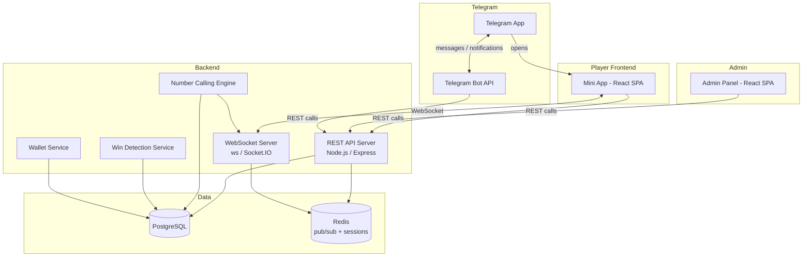
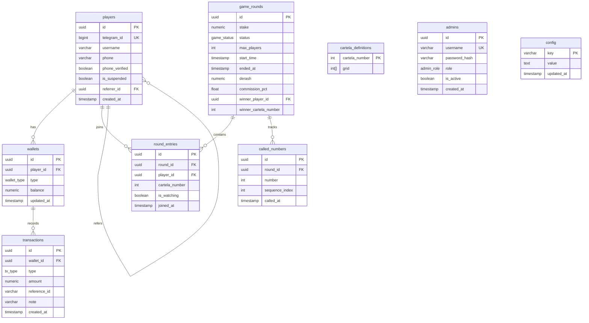

# Design Document

## Beteseb Bingo — Telegram Mini App

---

## Overview

Beteseb Bingo is a real-time, stake-based bingo game platform delivered as a Telegram Mini App. Players authenticate via Telegram, select cartela cards, and compete in live bingo rounds where the system calls numbers pseudorandomly every 5 seconds. The platform manages two wallet types (Main Wallet in Birr, Play Wallet in credits), a referral system, and a web-based Admin Panel for operators.

The system is composed of five major subsystems:

1. **Backend API Server** — REST API for all non-real-time operations
2. **WebSocket Server** — real-time game events (number calls, win notifications, player joins)
3. **Telegram Bot** — entry point and push notifications
4. **Telegram Mini App (Player Frontend)** — React-based SPA launched from Telegram
5. **Admin Panel (Web)** — separate React SPA for operators

---

## Architecture



### Key Design Decisions

- **Monorepo layout**: Backend, Mini App frontend, and Admin Panel share one repository for easier deployment and type sharing.
- **Single backend process** exposes both HTTP (REST) and WebSocket on the same port, sharing auth middleware and DB connections.
- **Redis pub/sub** decouples the Number Calling Engine (running as a timer loop) from the WebSocket broadcast layer, enabling horizontal scaling if needed.
- **PostgreSQL** is the single source of truth for all financial and game data. Redis is used only for ephemeral session state and pub/sub.
- **Telegram `initData` verification** is the sole authentication mechanism for players; no separate username/password.
- **Admin Panel** uses separate JWT-based auth with bcrypt-hashed passwords stored in the `admins` table.

---

## Technology Stack

| Layer | Choice | Rationale |
|---|---|---|
| Backend runtime | Node.js (TypeScript) | Strong ecosystem, non-blocking I/O for WebSockets, widely supported |
| HTTP framework | Express.js | Minimal, well-understood, easy middleware composition |
| WebSocket | Socket.IO | Rooms abstraction maps cleanly to Game_Round channels; built-in fallback |
| Database | PostgreSQL | ACID transactions for wallet operations; rich query support |
| ORM | Prisma | Type-safe queries, migration management, TypeScript-native |
| Cache / Pub-Sub | Redis (ioredis) | Fast ephemeral state; pub/sub for NCE → WS fan-out |
| Player Frontend | React + TypeScript + Vite | Fast HMR, Telegram Web App SDK integration |
| Admin Panel | React + TypeScript + Vite | Shared component patterns with Player app |
| Bot | grammY | Modern Telegram bot library for Node.js |
| Admin auth | JWT + bcrypt | Standard pattern; bcrypt for password hashing per requirements |
| Payment | Chapa / Telebirr (configurable) | Ethiopian payment gateways |
| Deployment | Docker Compose | Single-host deployment; can migrate to Kubernetes later |

---

## Components and Interfaces

### 1. Number Calling Engine (NCE)

Runs as an in-process timer loop per active `Game_Round`. Responsibilities:

- Generate a full pseudorandom shuffle of 1–75 at game start (Fisher-Yates).
- Call the next number at the configured interval (default 5 s).
- Publish each called number to Redis channel `game:{roundId}:number`.
- Persist each called number to `called_numbers` table immediately.
- Detect round end (all 75 called with no winner) and trigger void flow.

```
NCE start(roundId):
  sequence = shuffle([1..75])
  persist sequence start
  for each number in sequence:
    wait(callInterval)
    persist CallRecord(roundId, number, timestamp)
    publish Redis(game:{roundId}:number, {number, sequence_index})
    check win claims pending → trigger WinDetection if any
  if no winner: trigger void(roundId)
```

### 2. Win Detection Service

Validates win claims server-side. A client sends a `CLAIM_WIN` WebSocket event. The service:

1. Fetches the cartela grid for that player + round.
2. Fetches all called numbers up to and including the claim timestamp.
3. Checks if any standard pattern (row, column, diagonal) is complete using only called numbers.
4. If valid → credit Derash to winner's wallet, broadcast `ROUND_WON` event, close round.
5. If invalid → send `WIN_REJECTED` to claimant only.

Patterns checked (5×5 grid):
- 5 rows × 5 columns = 10 lines
- 2 diagonals
- Total: 12 possible winning lines

### 3. Wallet Service

All balance mutations go through this service with a Postgres transaction:

```
debit(playerId, amount, type, referenceId):
  BEGIN TRANSACTION
    SELECT balance ... FOR UPDATE
    IF balance < amount → RAISE InsufficientFunds
    UPDATE wallet SET balance = balance - amount
    INSERT transaction(...)
  COMMIT

credit(playerId, amount, type, referenceId):
  BEGIN TRANSACTION
    UPDATE wallet SET balance = balance + amount
    INSERT transaction(...)
  COMMIT
```

The `FOR UPDATE` row lock prevents double-spend race conditions.

### 4. Telegram Bot

Built with grammY. Handles:
- `/start` command with optional referral parameter (`?start=ref_<telegramId>`)
- Sends the Mini App inline keyboard button.
- Notification dispatch: game start alerts, win confirmations, transaction confirmations.

### 5. REST API Server

Express.js with middleware stack: `cors → helmet → rateLimiter → telegramAuthMiddleware | jwtAdminMiddleware → route handlers`.

### 6. WebSocket Server (Socket.IO)

Rooms: one room per `Game_Round` (`round:{roundId}`). Events:

| Direction | Event | Payload |
|---|---|---|
| Server → Client | `NUMBER_CALLED` | `{number, sequenceIndex, calledAt}` |
| Server → Client | `ROUND_STARTED` | `{roundId, playerCount, derash}` |
| Server → Client | `ROUND_WON` | `{winnerUsername, cartelaNumber, derash}` |
| Server → Client | `ROUND_VOID` | `{roundId, refundAmount}` |
| Server → Client | `PLAYER_JOINED` | `{playerCount}` |
| Client → Server | `JOIN_ROUND` | `{roundId, token}` |
| Client → Server | `CLAIM_WIN` | `{roundId, cartelaId}` |

---

## Data Models



### Enum Types

```sql
CREATE TYPE wallet_type AS ENUM ('main', 'play');
CREATE TYPE tx_type AS ENUM ('deposit', 'withdrawal', 'game_entry', 'game_win', 'referral_commission', 'admin_credit', 'admin_debit', 'refund');
CREATE TYPE game_status AS ENUM ('pending', 'active', 'completed', 'cancelled', 'void');
CREATE TYPE admin_role AS ENUM ('admin', 'super_admin');
```

### Cartela Grid Layout

Each `cartela_definitions` row stores 25 numbers as a flat integer array (row-major: index 0–4 = B column, 5–9 = I column, etc.). The free space (center cell index 12) is represented as `0`.

Column ranges:
- B: 1–15, I: 16–30, N: 31–45, G: 46–60, O: 61–75

### Configuration Keys

| Key | Default | Description |
|---|---|---|
| `call_interval_ms` | `5000` | Milliseconds between number calls |
| `platform_commission_pct` | `10` | % deducted from prize pool |
| `referral_commission_pct` | `2` | % of stake credited to referrer |
| `min_players_to_start` | `2` | Minimum players before round auto-starts |

---

## API Design

### Player REST Endpoints

All player endpoints require `X-Telegram-Init-Data` header. The backend validates using HMAC-SHA256 with the bot token.

```
POST   /api/auth/login              — validate initData, upsert player, return JWT
GET    /api/players/me              — current player profile + wallet balances
GET    /api/rounds                  — list available (pending) rounds
GET    /api/rounds/:id              — round detail
POST   /api/rounds/:id/join         — reserve cartela, deduct stake
GET    /api/rounds/:id/cartelas     — available cartela numbers
GET    /api/history                 — player's game history (paginated)
GET    /api/wallet/transactions     — wallet transaction history (paginated)
POST   /api/wallet/deposit          — initiate deposit
POST   /api/wallet/withdraw         — request withdrawal
GET    /api/referral/link           — get player's referral link + stats
POST   /api/players/verify-phone    — submit phone for verification
```

### Admin REST Endpoints

All admin endpoints require `Authorization: Bearer <jwt>` with admin JWT.

```
POST   /api/admin/auth/login

GET    /api/admin/players                   — paginated player list + search
GET    /api/admin/players/:id               — player detail
PATCH  /api/admin/players/:id/suspend
PATCH  /api/admin/players/:id/restore
POST   /api/admin/players/:id/credit        — manual wallet adjustment

GET    /api/admin/rounds                    — all rounds with status
POST   /api/admin/rounds                    — create round
POST   /api/admin/rounds/:id/start          — force-start
DELETE /api/admin/rounds/:id                — cancel round

GET    /api/admin/withdrawals               — pending withdrawal requests
POST   /api/admin/withdrawals/:id/approve
POST   /api/admin/withdrawals/:id/reject
GET    /api/admin/revenue                   — revenue summary (filterable by date)

GET    /api/admin/config                    — all config keys
PUT    /api/admin/config/:key               — update config value

GET    /api/admin/admins                    — (super_admin only) list admins
POST   /api/admin/admins                    — (super_admin only) create admin
PATCH  /api/admin/admins/:id               — (super_admin only) update admin
```

---

## Security Considerations

### Telegram initData Verification

The backend validates `initData` per Telegram's specification:

1. Extract `hash` from `initData` query string.
2. Sort remaining fields alphabetically, join as `key=value\n`.
3. Compute HMAC-SHA256 over the data string using `HMAC-SHA256("WebAppData", botToken)` as the key.
4. Compare computed hash to extracted hash using a constant-time comparison.
5. Verify `auth_date` is within 3600 seconds of current time.

This validation runs on every player API request via middleware.

### Admin Authentication

- Passwords stored as bcrypt hashes (`saltRounds = 12`).
- JWT tokens expire in 8 hours; refresh token not implemented (admin re-logs).
- Super admin role required for admin account management.
- All admin actions are audit-logged with admin ID and timestamp.

### Financial Security

- All wallet mutations use `SELECT ... FOR UPDATE` within a Postgres transaction to prevent race conditions.
- Withdrawal requests create a `pending` transaction record; actual debit only on admin approval.
- Play Wallet credits are flagged and blocked from withdrawal at the application layer.
- Game entry deductions are atomic: cartela reservation and wallet debit in a single transaction.

### Rate Limiting

- Player auth endpoint: 10 req/min per IP.
- Win claim endpoint: 5 req/min per player.
- Deposit initiation: 3 req/min per player.

---

## Error Handling

| Scenario | Behavior |
|---|---|
| Invalid `initData` | HTTP 401 `INVALID_TELEGRAM_AUTH` |
| Insufficient wallet balance | HTTP 422 `INSUFFICIENT_BALANCE` |
| Cartela already taken | HTTP 409 `CARTELA_TAKEN` |
| Round not in pending state | HTTP 409 `ROUND_NOT_JOINABLE` |
| Win claim rejected | WS event `WIN_REJECTED` to claimant |
| Payment gateway failure | HTTP 502 `PAYMENT_GATEWAY_ERROR`; wallet unchanged |
| All 75 numbers called, no winner | `ROUND_VOID` broadcast; stakes refunded |
| Network disconnect during game | Client reconnects via Socket.IO and rejoins room |
| Admin cancel of active round | Refund all entries; broadcast `ROUND_CANCELLED` |

All API error responses follow the shape:
```json
{ "error": "ERROR_CODE", "message": "Human-readable description" }
```


---

## Correctness Properties

*A property is a characteristic or behavior that should hold true across all valid executions of a system — essentially, a formal statement about what the system should do. Properties serve as the bridge between human-readable specifications and machine-verifiable correctness guarantees.*

### Property 1: initData Authentication Soundness

*For any* Telegram `initData` payload, the authentication middleware should accept the payload if and only if the HMAC-SHA256 signature is valid and `auth_date` is within 3600 seconds of the current time. Any payload with a tampered hash, missing fields, or expired `auth_date` must be rejected with HTTP 401.

**Validates: Requirements 1.2, 1.3**

---

### Property 2: Player Upsert Idempotency

*For any* valid Telegram `initData` payload belonging to a given `telegram_id`, calling the login endpoint multiple times must always return the same player record (same `id`, same `telegram_id`) without creating duplicate rows.

**Validates: Requirements 1.1**

---

### Property 3: Available Cartelas Exclude Taken Ones

*For any* game round with some subset of cartela numbers already reserved by other players, the list of available cartelas returned by the API must contain no cartela number that is already taken in that round.

**Validates: Requirements 3.1, 3.2**

---

### Property 4: Cartela Join Atomicity — Balance Deduction

*For any* player whose wallet balance is greater than or equal to the stake amount, and any available cartela in a pending round, after a successful join: (a) the cartela must appear as taken in that round, and (b) the player's wallet balance must have decreased by exactly the stake amount. Both conditions must hold simultaneously (i.e., no partial state).

**Validates: Requirements 3.3**

---

### Property 5: Insufficient Balance Prevents Any Wallet Debit

*For any* debit operation (game entry or withdrawal) where the requested amount exceeds the player's current wallet balance, the operation must be rejected with an appropriate error and the wallet balance must remain unchanged.

**Validates: Requirements 3.4, 6.4**

---

### Property 6: Win Detection Soundness

*For any* cartela grid and *any* set of called numbers, the win detection function must return `true` if and only if at least one complete winning line (row, column, or diagonal) exists where every cell in that line contains a number present in the called numbers set.

**Validates: Requirements 4.5, 5.1, 5.2**

---

### Property 7: Win Claim for Watching-Only Player is Rejected

*For any* player who joined a round in "watching only" mode, a `CLAIM_WIN` event submitted by that player must be rejected without crediting any prize.

**Validates: Requirements 4.7**

---

### Property 8: Derash Calculation Invariant

*For any* game round with `N` players, stake amount `S`, and platform commission `C%`, the computed Derash must equal `N × S × (1 − C/100)`, rounded consistently. This must hold for all valid combinations of N, S, and C.

**Validates: Requirements 5.5**

---

### Property 9: Winner Receives Exact Derash Amount

*For any* completed game round with a confirmed winner, the winner's Main Wallet balance must increase by exactly the round's Derash amount when the win is confirmed.

**Validates: Requirements 5.3**

---

### Property 10: Every Wallet Mutation Produces a Transaction Record

*For any* wallet balance change (game entry deduction, win credit, deposit, withdrawal, refund, referral commission, admin adjustment), a corresponding transaction record must exist with the correct amount, type, wallet ID, and timestamp.

**Validates: Requirements 6.2**

---

### Property 11: Play Wallet Cannot Be Withdrawn

*For any* withdrawal request targeting a Play Wallet (regardless of balance), the system must reject the request without modifying the Play Wallet balance.

**Validates: Requirements 6.6**

---

### Property 12: Game History Ordering Invariant

*For any* player's game history response, all entries must be sorted in descending order by the round's `ended_at` timestamp (most recent first).

**Validates: Requirements 8.2**

---

### Property 13: Called Numbers Round-Trip Persistence

*For any* completed or active game round, the sequence of called numbers retrievable from the database must be identical to the sequence that was broadcast during the round (same numbers, same order by `sequence_index`), with no gaps or duplicates.

**Validates: Requirements 8.3, 16.4**

---

### Property 14: Referral Link Uniqueness

*For any* two distinct players, their generated referral links must differ. Specifically, the referral identifier embedded in each link must be unique per player.

**Validates: Requirements 9.1**

---

### Property 15: Referral Commission Credited on Paid Round Completion

*For any* player who has a referrer, after completing a paid game round, the referrer's Main Wallet balance must increase by exactly `stake × referral_commission_pct / 100`, and a transaction record of type `referral_commission` must exist.

**Validates: Requirements 9.3**

---

### Property 16: Suspended Player Cannot Join Rounds

*For any* player account with `is_suspended = true`, all attempts to join a game round must be rejected regardless of wallet balance or cartela availability.

**Validates: Requirements 12.3**

---

### Property 17: Cancellation / Void Refund Invariant

*For any* game round that is cancelled by an admin or ends void (all 75 numbers called with no winner), every player who paid a stake to join that round must have their source wallet credited by exactly the stake amount, and a transaction record of type `refund` must exist for each entry.

**Validates: Requirements 13.3, 16.3**

---

### Property 18: Admin Manual Adjustment Integrity

*For any* admin credit or debit operation on a player wallet, the wallet balance must change by exactly the specified amount and a transaction record with the mandatory reason note must be created. The operation must not affect any other player's wallet.

**Validates: Requirements 14.1**

---

### Property 19: Config Change Isolation

*For any* configuration change (commission rate, referral rate, stake options), game rounds that were already in `active` or `completed` state at the time of the change must retain their original snapshotted values (e.g., `commission_pct` captured at round creation). Only rounds created after the change may use the new values.

**Validates: Requirements 15.4**

---

### Property 20: No Duplicate Numbers in a Round

*For any* active or completed game round, the sequence of called numbers must contain no repeated values, and all values must be in the range 1–75 inclusive.

**Validates: Requirements 16.1**

---

## Testing Strategy

### Dual Testing Approach

Both unit tests and property-based tests are required. They are complementary:

- **Unit tests** verify concrete examples, integration points, and edge cases.
- **Property-based tests** verify universal properties across randomized inputs.

### Property-Based Testing

**Library**: `fast-check` (TypeScript/Node.js)

Each property defined above must be implemented as a single property-based test using `fc.assert(fc.property(...))` with a minimum of **100 iterations** per test.

Each test must include a comment tag referencing its design property:

```
// Feature: beteseb-bingo-telegram, Property <N>: <property_text>
```

Property test file structure:
```
src/
  __tests__/
    properties/
      auth.property.test.ts          — Properties 1, 2
      cartela.property.test.ts       — Properties 3, 4, 5
      win-detection.property.test.ts — Properties 6, 7
      wallet.property.test.ts        — Properties 8, 9, 10, 11, 15, 17, 18
      history.property.test.ts       — Properties 12, 13
      referral.property.test.ts      — Properties 14, 15
      admin.property.test.ts         — Properties 16, 18, 19
      nce.property.test.ts           — Property 20
```

**Property test configuration:**
```typescript
fc.assert(
  fc.property(arbitraries, (inputs) => {
    // property body
  }),
  { numRuns: 100 }
);
```

### Unit Testing

**Framework**: Vitest

Unit tests focus on:
- Specific known examples (e.g., a specific 5×5 cartela grid with a known winning line)
- Integration points (wallet service + database transaction)
- Edge cases (free space at index 12, all 75 numbers called, zero-balance wallet)
- Error paths (invalid initData format, expired auth_date)

Avoid writing exhaustive unit tests for cases already covered by property tests. Prefer property tests for any logic involving ranges, collections, or combinatorial inputs.

### Test Runners

Run tests with:
```
vitest --run
```

Do not use watch mode in CI environments.

### Coverage Targets

- Win detection logic: 100% branch coverage (property tests cover this)
- Wallet service: 100% branch coverage
- Number calling engine: property test verifies no-duplicate invariant
- Auth middleware: property test covers valid/invalid/expired cases
