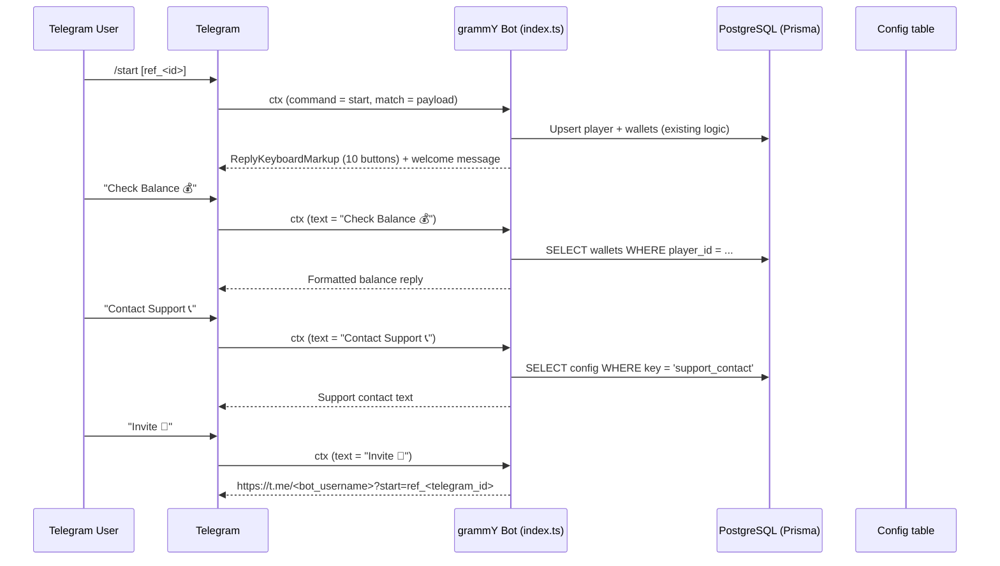

# Design Document: bot-start-menu

## Overview

This feature replaces the existing `/start` inline-keyboard response with a persistent `ReplyKeyboardMarkup` that stays visible in the user's Telegram keyboard area throughout the session. The menu exposes 10 shortcut buttons covering all major bot actions. Each button dispatches a text message that is handled by a dedicated `bot.hears()` handler.

The change is entirely contained in `apps/backend/src/bot/index.ts`. No new database models, migrations, or API routes are required.

---

## Architecture

The bot is built with **grammY**. The current `/start` handler sends an `InlineKeyboard`; this feature replaces that with a `ReplyKeyboardMarkup` and adds ten `bot.hears()` handlers alongside it.



### Key design decisions

- **`ReplyKeyboardMarkup` over `InlineKeyboard`**: Reply keyboards persist in the keyboard area without re-sending a message each time, matching the requirement for a "persistent" menu.
- **`bot.hears()` handlers**: Each button's text label is unique, so grammY's text-matching listener is sufficient — no command parsing needed.
- **Registration guard**: A shared helper checks whether the sending player has `phone_verified = true` (or a player record at all) and returns the registration prompt early, keeping each handler small.
- **Static replies**: Deposit, Instruction, Transfer, Withdraw, and Convert Bonus handlers return hard-coded informational text. No DB round-trip needed.
- **Support contact**: The `Contact Support` handler reads the `support_contact` key from the `Config` table at call time, so admins can update it without redeploying.

---

## Components and Interfaces

### `buildMainMenu(): ReplyKeyboardMarkup` (pure helper)

Returns the grammY `Keyboard` object configured with all 10 buttons, `resizeKeyboard()`, and `persistent()`.

```
Row 0: "Play 🎮"           | "Register 📝"
Row 1: "Check Balance 💰"  | "Deposit 💰"
Row 2: "Contact Support 📞"| "Instruction 📖"
Row 3: "Transfer 🎁"       | "Withdraw 🤑"
Row 4: "Invite 🔗"         | "Convert Bonus 💲"
```

### `/start` command handler (modified)

Existing player upsert + wallet creation logic is **preserved unchanged**. The only modification is replacing the final `InlineKeyboard` reply with the `ReplyKeyboardMarkup` reply and updated welcome text.

### `isRegistered(telegramId: bigint): Promise<boolean>` (pure DB helper)

Looks up whether a player with `phone_verified = true` exists for the given `telegram_id`. Used by guarded handlers.

### Menu button handlers (`bot.hears(...)`)

| Button text | DB access | Notes |
|---|---|---|
| `"Play 🎮"` | none | Sends `InlineKeyboard.webApp(...)` pointing to `MINI_APP_URL` |
| `"Register 📝"` | none | Sends phone-number prompt (unguarded) |
| `"Check Balance 💰"` | `wallets` | Reads main + play balance for the player |
| `"Deposit 💰"` | none | Static instructions reply |
| `"Contact Support 📞"` | `config` | Reads `support_contact` key |
| `"Instruction 📖"` | none | Static how-to-play reply |
| `"Transfer 🎁"` | none | Static instructions reply |
| `"Withdraw 🤑"` | none | Static instructions reply |
| `"Invite 🔗"` | none | Generates deep-link from `ctx.from.id` + `bot.botInfo.username` |
| `"Convert Bonus 💲"` | none | Static instructions reply |

---

## Data Models

No schema changes required. The feature reads from existing tables:

- `players` — `telegram_id`, `phone_verified`
- `wallets` — `player_id`, `type` (`main` | `play`), `balance`
- `config` — `key = 'support_contact'`, `value`

The referral deep-link uses `bot.botInfo.username`, which grammY populates after `bot.init()` (already called before handlers run in the existing setup).

---

## Correctness Properties

*A property is a characteristic or behavior that should hold true across all valid executions of a system — essentially, a formal statement about what the system should do. Properties serve as the bridge between human-readable specifications and machine-verifiable correctness guarantees.*

### Property 1: Invite link format

*For any* player with any Telegram ID, the invite link generated by the `"Invite 🔗"` handler must match the format `https://t.me/<bot_username>?start=ref_<telegram_id>` exactly — where `<telegram_id>` is the player's numeric Telegram ID and `<bot_username>` is the configured bot username.

**Validates: Requirements 4.9**

---

### Property 2: New player creation completeness

*For any* new Telegram user who sends `/start` and has no existing player record, the handler must create exactly one player record and exactly two wallet records (one of type `main`, one of type `play`) within the same transaction.

**Validates: Requirements 3.2**

---

### Property 3: Idempotent player upsert

*For any* Telegram user who already has a player record, sending `/start` any number of times must never create additional player records — only the `username` field may change. The count of player records for that `telegram_id` must remain exactly 1.

**Validates: Requirements 3.3**

---

### Property 4: Referrer attribution for valid payloads

*For any* `/start` payload of the form `ref_<telegramId>` where `<telegramId>` corresponds to an existing player, a newly created player record must have `referrer_id` set to the matching referrer's UUID. If the referrer does not exist, `referrer_id` must be `null`.

**Validates: Requirements 3.1**

---

### Property 5: Balance reply completeness

*For any* player with any combination of main and play wallet balances, the reply from the `"Check Balance 💰"` handler must include both the `main` balance value and the `play` balance value as formatted numbers.

**Validates: Requirements 4.3**

---

### Property 6: Support contact reply reflects config

*For any* value stored in the `Config` table under the key `support_contact`, the reply from the `"Contact Support 📞"` handler must include that exact value in the reply text.

**Validates: Requirements 4.5**

---

### Property 7: Unregistered player guard

*For any* player who has no verified phone (i.e., `phone_verified = false` or no player record), and *for any* menu button text that is not `"Register 📝"` or `"Play 🎮"`, the handler must reply with a registration prompt and must not attempt to perform the button's primary action.

**Validates: Requirements 4.11**

---

## Error Handling

| Scenario | Behaviour |
|---|---|
| DB transaction fails in `/start` | Catch block sends `"Something went wrong. Please try again later."` and `console.error`s the error (existing behaviour, preserved) |
| `ctx.from` is undefined | Return early, no reply (existing behaviour, preserved) |
| `Check Balance` — player not found in DB | Reply with registration prompt (covered by registration guard) |
| `Contact Support` — `support_contact` key missing from Config | Reply with a fallback message: `"Support contact is not configured. Please try again later."` |
| `Invite` — `bot.botInfo` not yet initialised | Should not occur in practice since `bot.init()` completes before handlers are registered; log warning if it does |
| Any `hears` handler throws unexpectedly | grammY global error handler catches and logs; no crash |

---

## Testing Strategy

### Unit / example tests

Implemented with **Vitest** (already in use). Focus on specific inputs and edge cases:

- Main menu keyboard structure: correct button count (10), correct row/column layout (5×2), `resize_keyboard = true`, `one_time_keyboard = false`, exact labels including emojis
- Welcome message text matches requirement exactly
- Static handler replies: each of Deposit, Instruction, Transfer, Withdraw, Convert Bonus returns a non-empty string containing expected keywords
- Play handler: reply contains an `InlineKeyboard` with a `web_app` button pointing to `MINI_APP_URL`
- Register handler: reply text contains a phone-number prompt
- Error path: when DB throws, reply text equals `"Something went wrong. Please try again later."`
- Support contact fallback: when config key is absent, reply is the fallback message

### Property-based tests

Implemented with **fast-check** (already in use). Minimum 100 iterations per property.

Each test is tagged:
`// Feature: bot-start-menu, Property <N>: <property_text>`

| Property | Test description |
|---|---|
| Property 1 | For any bigint Telegram ID and any bot username string, `buildInviteLink(botUsername, telegramId)` must equal `https://t.me/${botUsername}?start=ref_${telegramId}` |
| Property 2 | In-memory simulation: for any new player input, the create transaction produces exactly 1 player and 2 wallet records |
| Property 3 | In-memory simulation: for any existing player, the upsert transaction leaves player count at 1 and returns the same player ID |
| Property 4 | In-memory simulation: for any valid referrer telegram ID, the newly created player's referrer_id equals the referrer's UUID; for any unknown ID, referrer_id is null |
| Property 5 | For any pair of Decimal balance values (main, play), `formatBalanceReply(mainBalance, playBalance)` must contain both formatted values |
| Property 6 | For any non-empty string value, `formatSupportReply(contactValue)` must contain that value |
| Property 7 | For any menu button text not in the exempt set, `isGuardedButton(text)` must return true; for "Register 📝" and "Play 🎮" it must return false |

All property tests live in `apps/backend/src/__tests__/properties/bot-start-menu.property.test.ts`.
