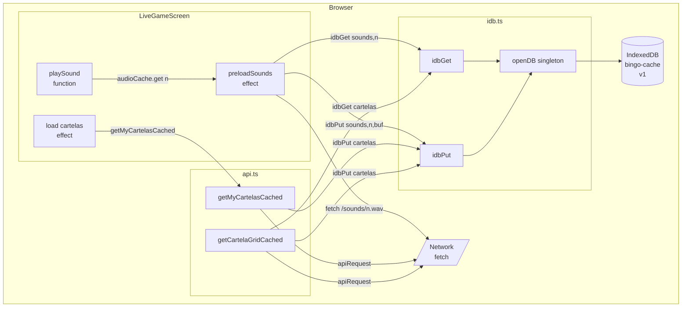

# Design Document: IndexedDB Cartela & Sound Caching

## Overview

This feature consolidates and completes the IndexedDB caching layer in the Fidel Bingo mini-app. Two concerns are addressed together because they share the same storage infrastructure (`idb.ts`) and the same runtime context (`LiveGameScreen`):

1. **Sound caching** — All 75 `.wav` files are fetched once, persisted as `ArrayBuffer` in the `sounds` store, and served from cache on subsequent visits. Repeated network downloads on every session are eliminated.
2. **Cartela grid caching** — The 5×5 grid for each cartela the player has joined is written to the `cartelas` store immediately after being fetched, so a mid-game page reload does not require a new API call.

All changes are confined to three existing files: `idb.ts`, `api.ts`, and `LiveGameScreen.tsx`. No new files are introduced.

---

## Architecture



The flow is **cache-first, write-through**:
- Reads check IDB first; on miss they fall back to the network and then populate the cache.
- Writes happen fire-and-forget — the UI is never blocked waiting for an IDB write to complete.
- All IDB errors are swallowed at the call-site; callers continue using in-memory or network values.

---

## Components and Interfaces

### `idb.ts` — No changes required

The existing implementation already satisfies all Requirement 1 criteria:

| Criteria | Status |
|---|---|
| Opens `bingo-cache` v1 | ✅ `DB_NAME = 'bingo-cache'`, `DB_VERSION = 1` |
| Creates both object stores in `onupgradeneeded` | ✅ |
| Resets `dbPromise = null` on `onerror` so next call retries | ✅ |
| Exposes only `idbGet` and `idbPut` | ✅ |
| Singleton promise | ✅ `if (dbPromise) return dbPromise` |

No modifications needed.

---

### `api.ts` — Add two caching wrappers

#### `getCartelaGridCached(roundId, cartelaNumber)`

New exported function. Wraps the existing `getCartelaGrid` with IDB read-before-fetch / write-after-fetch logic.

```ts
export async function getCartelaGridCached(
  roundId: string,
  cartelaNumber: number,
): Promise<{ cartela_number: number; grid: number[] }> {
  const key = `${roundId}:${cartelaNumber}`;
  const cached = await idbGet<{ cartela_number: number; grid: number[] }>('cartelas', key);
  if (cached) return cached;
  const result = await apiRequest<{ cartela_number: number; grid: number[] }>(
    'GET',
    `/api/rounds/${roundId}/cartelas/${cartelaNumber}/grid`,
  );
  idbPut('cartelas', key, result).catch(() => {}); // fire-and-forget, quota errors silenced
  return result;
}
```

Key points:
- If `idbGet` returns a value, the API call is skipped entirely (Requirement 3.1).
- If the API call throws, `idbPut` is never reached (Requirement 3.3 — no partial writes).
- The `idbPut` is fire-and-forget; the return value of the function does not depend on the write completing (Requirement 4.4).

#### `getMyCartelas` — updated to write-through

The existing `getMyCartelas` is replaced with a version that writes each cartela to the store after fetching:

```ts
export async function getMyCartelas(
  roundId: string,
): Promise<{ cartelas: Array<{ cartelaNumber: number; cartelaGrid: number[] }> }> {
  const result = await apiRequest<{ cartelas: Array<{ cartelaNumber: number; cartelaGrid: number[] }> }>(
    'GET',
    `/api/rounds/${roundId}/my-cartelas`,
  );
  // Write each cartela grid to IDB so a mid-game reload can skip the API call
  for (const c of result.cartelas) {
    const key = `${roundId}:${c.cartelaNumber}`;
    idbPut('cartelas', key, { cartela_number: c.cartelaNumber, grid: c.cartelaGrid }).catch(() => {});
  }
  return result;
}
```

Note the stored shape is `{ cartela_number, grid }` — consistent with what `getCartelaGridCached` reads back — satisfying Requirement 3.5.

---

### `LiveGameScreen.tsx` — Minimal changes

#### `preloadSounds` — already correct

The existing implementation in the `useEffect` hook already satisfies all Requirement 2 criteria:

| Criteria | Status |
|---|---|
| Loads all 75 sounds in parallel via `Promise.all` | ✅ |
| Reads from IDB (`idbGet`) before fetching | ✅ |
| Stores `ArrayBuffer` to IDB after fetching | ✅ fire-and-forget `.catch(() => {})` |
| Falls back to URL `Audio` element on any error | ✅ `catch` block |
| Skips sounds already in `audioCache` | ✅ `if (audioCache.current.has(n)) return` |
| Does not block render | ✅ `preloadSounds()` called without `await` |

No changes needed.

#### `getCartelaGrid` call in `onWon` handler

The socket `onWon` handler fetches the winner's cartela grid for display. This call is already isolated (watching users can see the winner's card) and is not a player's own cartela — so it should use `getCartelaGridCached` to avoid re-fetching if the winner's cartela was already loaded earlier in the session.

Change: replace `getCartelaGrid` with `getCartelaGridCached` in the `onWon` handler.

#### No other changes to `LiveGameScreen.tsx`

The `load()` effect already calls `getMyCartelas`, which after the `api.ts` change will automatically write-through to IDB. No additional changes are needed in the screen.

---

## Data Models

### Sound_Store

| Field | Type | Notes |
|---|---|---|
| key | `number` (1–75) | Integer sound number |
| value | `ArrayBuffer` | Raw `.wav` binary |

### Cartela_Store

| Field | Type | Notes |
|---|---|---|
| key | `string` | `"${roundId}:${cartelaNumber}"` |
| value | `{ cartela_number: number; grid: number[] }` | Serializable plain object |

Both stores are created with the default key path (out-of-line keys), consistent with the current `idb.ts` implementation.

The `grid` is a flat 25-element `number[]` in row-major order. The free center square (index 12) is stored as `0` per the existing convention in `LiveGameScreen`.

---

## Correctness Properties

*A property is a characteristic or behavior that should hold true across all valid executions of a system — essentially, a formal statement about what the system should do. Properties serve as the bridge between human-readable specifications and machine-verifiable correctness guarantees.*

### Property 1: IDB singleton

*For any* number of calls to `openDB()` within the same page session, all calls shall return the same `Promise<IDBDatabase>` object (referential equality on the promise, not just the resolved value).

**Validates: Requirements 1.5**

---

### Property 2: Sound preload completeness

*For any* fresh `audioCache` (empty map), after `preloadSounds()` resolves, `audioCache` shall contain exactly 75 entries — one for each integer key 1 through 75.

**Validates: Requirements 2.1**

---

### Property 3: Sound IDB cache hit avoids network

*For any* sound number `n` in 1–75, if `idbGet('sounds', n)` returns an `ArrayBuffer`, then `preloadSounds()` shall not call `fetch` for `/sounds/${n}.wav`.

**Validates: Requirements 2.2**

---

### Property 4: Sound IDB cache miss triggers fetch and write

*For any* sound number `n` in 1–75, if `idbGet('sounds', n)` returns `undefined`, then `preloadSounds()` shall call `fetch('/sounds/${n}.wav')` and subsequently call `idbPut('sounds', n, <ArrayBuffer>)` with the fetched buffer.

**Validates: Requirements 2.3**

---

### Property 5: Sound preload never throws

*For any* sound number `n` in 1–75, if either `idbGet`, `fetch`, or `idbPut` throws or rejects, `preloadSounds()` shall still produce an entry in `audioCache` for key `n` (falling back to a URL-based `Audio` element) and shall not propagate the error.

**Validates: Requirements 2.4**

---

### Property 6: In-memory sound cache skips IDB and network

*For any* sound number `n` already present in `audioCache`, calling `preloadSounds()` again shall not invoke `idbGet` or `fetch` for that key.

**Validates: Requirements 2.5**

---

### Property 7: Cartela cache hit avoids API call

*For any* `(roundId, cartelaNumber)` pair where `idbGet('cartelas', key)` returns a value, `getCartelaGridCached(roundId, cartelaNumber)` shall return that cached value without calling `apiRequest`.

**Validates: Requirements 3.1**

---

### Property 8: Cartela cache miss fetches and writes

*For any* `(roundId, cartelaNumber)` pair where `idbGet` returns `undefined`, `getCartelaGridCached` shall call `apiRequest` and, on success, call `idbPut('cartelas', key, result)` before returning the result.

**Validates: Requirements 3.2**

---

### Property 9: Cartela API failure produces no store write

*For any* `(roundId, cartelaNumber)` where `apiRequest` throws, `getCartelaGridCached` shall propagate the error and `idbPut` shall not be called.

**Validates: Requirements 3.3**

---

### Property 10: getMyCartelas write-through

*For any* `roundId` where `getMyCartelas` returns a list of `k` cartelas, exactly `k` calls to `idbPut('cartelas', ...)` shall be made — one per cartela — each with key `"${roundId}:${c.cartelaNumber}"` and value `{ cartela_number: number, grid: number[] }`.

**Validates: Requirements 3.4, 3.5**

---

### Property 11: Sound mute skips playback

*For any* number `n` in 1–75, when `soundOnRef.current` is `false`, `playSound(n)` shall not call `.play()` on any `HTMLAudioElement`.

**Validates: Requirements 5.3**

---

### Property 12: Sound identity

*For any* number `n` in 1–75 present in `audioCache`, `playSound(n)` shall call `.play()` on exactly `audioCache.get(n)` and no other element.

**Validates: Requirements 5.1, 5.4**

---

### Property 13: IDB cartela round-trip

*For any* valid cartela grid object `g` of shape `{ cartela_number: number, grid: number[] }`, calling `idbPut('cartelas', key, g)` followed by `idbGet('cartelas', key)` shall produce an object deeply equal to `g`, with the `grid` array preserving element order and numeric types.

**Validates: Requirements 6.1, 6.2, 6.3**

---

## Error Handling

| Scenario | Handling |
|---|---|
| `openDB` fails (IDB unavailable, e.g. private browsing) | `dbPromise` reset to `null`; `idbGet` rejects; callers `.catch(() => {})` swallow it and use network/memory fallback |
| `idbPut` fails with `QuotaExceededError` | Fire-and-forget `.catch(() => {})` at each call site — write is silently dropped, in-memory state is unaffected |
| `fetch` fails during sound preload | `catch` block in `load(n)` creates a URL-based `Audio` element; game screen is not affected |
| API call fails in `getCartelaGridCached` | Error propagates to the caller (socket `onWon` handler uses `.catch(() => {})` so it's swallowed there) |
| `Audio.play()` rejected (NotAllowedError) | Retried once after 300ms via `setTimeout` |
| All other IDB errors | `idbGet` / `idbPut` reject; each call site already wraps in `.catch(() => {})` |

The guiding principle: **cache failures are never fatal**. Every IDB operation is on the happy path for performance, not correctness. The app must function fully without IndexedDB.

---

## Testing Strategy

### Dual Testing Approach

Unit tests handle specific examples, integration edge cases, and error branches. Property-based tests (PBT) verify universal correctness across randomized inputs.

### Property-Based Testing

Use **fast-check** (TypeScript-native, available in the existing ecosystem).

Each property test runs a minimum of **100 iterations**.

Tag format for each test: `// Feature: indexdb-cartela-sound, Property N: <property text>`

| Property | PBT pattern | Generator sketch |
|---|---|---|
| P1: IDB singleton | Invariant | Call `openDB()` N times, assert same reference |
| P2: Preload completeness | Invariant | Stub IDB/fetch; run preload; check map size = 75 |
| P3: Sound cache hit | Metamorphic | Arbitrary `n` in 1–75, stub idbGet → ArrayBuffer, verify fetch not called |
| P4: Sound cache miss | Round-trip-like | Arbitrary `n`, stub idbGet → undefined + fetch, verify idbPut called with ArrayBuffer |
| P5: Sound fallback | Error condition | Arbitrary `n`, make fetch reject, verify audioCache has entry, no throw |
| P6: Skip cached sounds | Idempotence | Pre-fill audioCache; run preload again; verify idbGet/fetch call count = 0 |
| P7: Cartela cache hit | Round-trip | Arbitrary roundId + cartelaNumber, stub idbGet → value, verify apiRequest not called |
| P8: Cartela cache miss | Round-trip | Arbitrary inputs, stub idbGet → undefined, verify apiRequest + idbPut called |
| P9: Cartela API failure | Error condition | Make apiRequest reject, verify idbPut call count = 0 |
| P10: Write-through | Invariant | Arbitrary cartela list of size k, verify idbPut call count = k with correct keys |
| P11: Sound mute | Invariant | Arbitrary `n`, soundOn=false, verify play() never called |
| P12: Sound identity | Invariant | Arbitrary `n` in audioCache, verify play() called on exactly that element |
| P13: IDB round-trip | Round-trip | Arbitrary `{ cartela_number: integer, grid: integer[] }`, put then get, assert deep equal |

### Unit Tests

Unit tests focus on:

- **IDB initialization** (Requirements 1.1–1.4): assert DB name, version, store names, exported symbol set.
- **Error reset** (Requirement 1.3): simulate `onerror`, call `openDB()` again, assert a new request is issued.
- **QuotaExceededError** (Requirement 4.1): simulate quota error in `idbPut`, assert caller does not throw.
- **IDB unavailable** (Requirement 4.2): simulate `indexedDB.open` throwing, assert `idbGet` resolves `undefined`, `idbPut` is no-op.
- **Autoplay retry** (Requirement 5.2): simulate `NotAllowedError` from `play()`, assert `setTimeout` called with ≈300ms delay.

### Test File Locations

```
apps/mini-app/src/__tests__/
  idb.test.ts            — unit + property tests for idb.ts
  api.cartela.test.ts    — unit + property tests for getCartelaGridCached, getMyCartelas
  LiveGameScreen.sound.test.ts  — unit + property tests for preloadSounds, playSound
```

### Non-Testable Items

- **Render non-blocking** (Requirements 4.3, 4.4): verified by code review — `preloadSounds()` is called without `await` and `idbPut` calls are fire-and-forget.
- **Visual feedback** (Requirement 5 UI aesthetics): outside automated test scope.
