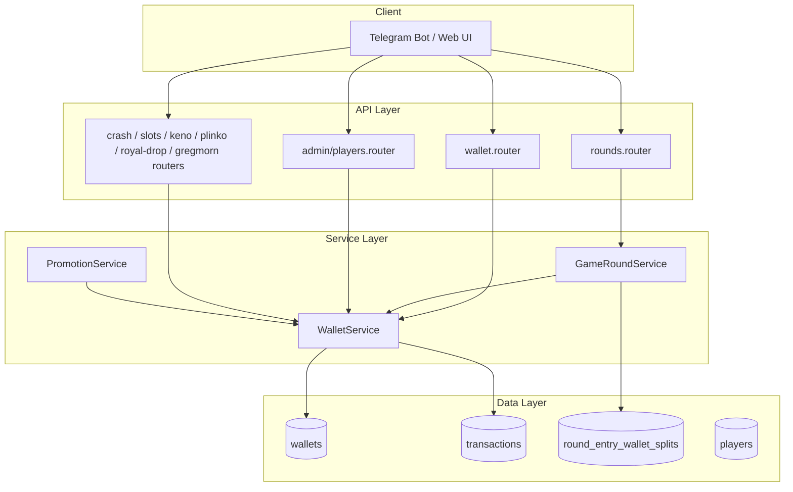

# Design Document — Multi-Wallet Balance System

## Overview

This feature extends the existing two-wallet system (`main`, `play`) by adding a third `bonus` wallet and hardening the debit priority rules across all game types. The change is almost entirely a backend concern: a schema migration, an upgrade to `WalletService`, and targeted updates to every call-site that touches balances.

**Before:**
- `main` — receives winnings, used for withdrawals.
- `play` — receives deposits, used for game stakes (debitDual: play → main).

**After:**
- `main` — same role.
- `play` — same role.
- `bonus` — receives promotion/welcome credits; used **only** for Bingo stakes (bonus → play → main).
- Non-Bingo games use play → main (bonus is never touched).

Key design decisions:
- The `debitDual` method is replaced by `debitWithPriority(gameType, ...)`, which encodes the priority order internally.
- Round-entry balance checks and the payment collection loop in `GameRoundService.start()` both need to include `bonus` for Bingo.
- Refunds on void/cancel must restore each wallet in the exact split that was originally debited, so the split must be persisted. A new `RoundEntryWalletSplit` table stores this.
- The `WalletType` enum gains a `bonus` value in both Prisma schema and the `@fidel/shared` package.

---

## Architecture



Data flow for a Bingo stake deduction:

```
GameRoundService.start()
  └─ WalletService.debitWithPriority("bingo", playerId, stake, ...)
       ├─ bonus wallet (drain first)
       ├─ play wallet  (then)
       └─ main wallet  (finally)
  └─ persist split → RoundEntryWalletSplit
```

Data flow for a Non-Bingo stake deduction:

```
CrashEngine / SlotsEngine / etc.
  └─ WalletService.debitWithPriority("non_bingo", playerId, amount, ...)
       ├─ play wallet (first)
       └─ main wallet (then)
       bonus wallet is NEVER touched
```

---

## Components and Interfaces

### 1. WalletService (updated)

New primary method replaces `debitDual`:

```typescript
type GameContext = 'bingo' | 'non_bingo';

interface DebitResult {
  /** Per-wallet amounts that were actually debited. */
  splits: Array<{ walletType: WalletType; walletId: string; amount: number }>;
}

WalletService.debitWithPriority(
  tx: PrismaTransaction,       // must be called inside a prisma.$transaction
  playerId: string,
  amount: number,
  context: GameContext,
  txType: TxType,
  referenceId?: string,
  note?: string,
): Promise<DebitResult>
```

The priority order is determined by `context`:
- `'bingo'`     → `[bonus, play, main]`
- `'non_bingo'` → `[play, main]`

`debit` (single-wallet) and `credit` remain unchanged.

`assertWithdrawable` is updated to also reject `bonus` wallet.

New helper:

```typescript
WalletService.getBalances(playerId: string): Promise<{
  main: number; play: number; bonus: number;
}>
```

### 2. GameRoundService (updated)

`joinBatch` / `join` — soft balance check updated to include bonus wallet for Bingo.

`start()` — payment collection loop updated:
1. Call `debitWithPriority('bingo', ...)` inside the per-entry transaction.
2. Store the returned `splits` in `RoundEntryWalletSplit`.

`cancel()` / void refund — refund logic updated:
1. Load `RoundEntryWalletSplit` records for each entry.
2. Credit each wallet exactly the amount recorded in the split.

### 3. Non-Bingo game routers & engines (updated)

All call-sites of `WalletService.debitDual` in the following are updated to `debitWithPriority('non_bingo', ...)`:
- `CrashEngine`
- `SlotsEngine`
- `KenoEngine`
- `PlinkoBet` handler
- `RoyalDropEngine`
- `gregmorn-callback.router` (ext_game_bet)

### 4. PromotionService (updated)

`applyBonusToEligiblePlayers` — currently credits `main` or `play` wallet.  
Updated to accept `bonus` as a valid `bonus_wallet` value and call `WalletService.credit` with `WalletType.bonus`.

### 5. Player creation (updated)

Wherever a new player's wallets are seeded (bot auth flow / `auth.router`), a third wallet of type `bonus` with balance `0` is created alongside the existing two.

### 6. API response shapes (updated)

`PlayerProfile` and `JoinRoundResponse` in `@fidel/shared/api.ts` gain `bonusWallet: WalletBalance` and `bonusWalletBalance: number` respectively.

`AdminPlayer` gains `bonus_wallet_balance: number`.

### 7. Admin player endpoint (updated)

`GET /api/admin/players/:id` and `GET /api/admin/players` return `bonus_wallet_balance`.

`POST /api/admin/players/:id/credit` already accepts a `walletType` string — the validation just needs to permit `'bonus'` once the enum is extended.

---

## Data Models

### Schema changes

#### 1. Extend `WalletType` enum

```prisma
enum WalletType {
  main
  play
  bonus   // ← new
}
```

#### 2. New table: `RoundEntryWalletSplit`

Stores the per-wallet debit amounts for each round entry so that refunds can be issued to the exact correct wallets.

```prisma
model RoundEntryWalletSplit {
  id             String    @id @default(uuid())
  round_id       String
  player_id      String
  cartela_number Int
  wallet_id      String
  wallet_type    WalletType
  amount         Decimal   @db.Decimal(14, 2)

  @@index([round_id, player_id])
  @@map("round_entry_wallet_splits")
}
```

#### 3. Promotion model `bonus_wallet` field

The `Promotion.bonus_wallet` column already has type `WalletType?` in Prisma, so it will automatically accept `bonus` once the enum is extended. No structural change needed.

### Shared enum extension (`packages/shared/src/enums.ts`)

```typescript
export type WalletType = 'main' | 'play' | 'bonus';
export const WalletType = {
  main:  'main'  as WalletType,
  play:  'play'  as WalletType,
  bonus: 'bonus' as WalletType,   // ← new
};
```

### Migration

One Prisma migration:
1. Add `bonus` to the `WalletType` PostgreSQL enum.
2. Create the `round_entry_wallet_splits` table.
3. Backfill: insert a `bonus` wallet (balance = 0) for every existing player that doesn't already have one.

---

## Correctness Properties

*A property is a characteristic or behavior that should hold true across all valid executions of a system — essentially, a formal statement about what the system should do. Properties serve as the bridge between human-readable specifications and machine-verifiable correctness guarantees.*

### Property 1: Three-wallet invariant

*For any* player in the system, querying their wallets should always return exactly three records — one of each type: `main`, `play`, and `bonus` — each with a non-negative balance.

**Validates: Requirements 1.1, 1.2, 1.3**

---

### Property 2: Deposit credits Play wallet exclusively

*For any* confirmed deposit of a positive amount, the Play wallet balance should increase by exactly that amount, and neither the Main nor Bonus wallet balance should change.

**Validates: Requirements 2.1, 2.2, 5.4**

---

### Property 3: Win payout credits Main wallet exclusively

*For any* game win payout of a positive amount, the Main wallet balance should increase by exactly that amount, and neither the Play nor Bonus wallet balance should change.

**Validates: Requirements 3.1, 3.2, 3.4**

---

### Property 4: Withdrawal restricted to Main wallet

*For any* withdrawal request targeting the Play or Bonus wallet, the system should reject it with an error, and all wallet balances should remain unchanged.

**Validates: Requirements 4.1, 4.2**

---

### Property 5: Bonus funding credits Bonus wallet exclusively

*For any* promotion or welcome-bonus credit of a positive amount, the Bonus wallet balance should increase by exactly that amount, and neither the Main nor Play wallet balance should change.

**Validates: Requirements 5.1, 5.2, 5.4**

---

### Property 6: Bingo debit priority order

*For any* Bingo round stake and any player wallet state, the total amount debited across all wallets should equal the stake, the Bonus wallet should be drained first, then Play, then Main, and no wallet should be debited below zero.

**Validates: Requirements 6.1, 6.2, 6.3, 6.5**

---

### Property 7: Non-Bingo bonus wallet isolation

*For any* non-Bingo bet on any game type, the Bonus wallet balance should be identical before and after the bet is placed, regardless of how much Play and Main balance is available.

**Validates: Requirements 7.1, 7.3**

---

### Property 8: Debit conservation

*For any* stake deduction (Bingo or non-Bingo), the sum of all per-wallet debits recorded for that operation should equal the original stake amount exactly (no rounding drift).

**Validates: Requirements 6.5, 7.1**

---

### Property 9: Bingo refund round-trip

*For any* voided Bingo round, the wallet balances of every participant after refund should equal their balances immediately before they joined the round (i.e. join then void is a net-zero operation).

**Validates: Requirements 8.1, 8.2**

---

### Property 10: Insufficient funds rejection

*For any* game entry where the combined eligible wallet balances are less than the stake, the system should reject the attempt and leave all wallet balances unchanged.

**Validates: Requirements 6.4, 7.2, 4.3, 10.3**

---

### Property 11: Transaction atomicity

*For any* wallet operation (credit or debit), if the operation completes successfully there is exactly one Transaction record per wallet touched, and if it fails there are zero — no partial state should ever be observable.

**Validates: Requirements 11.1, 11.2, 11.3, 11.4**

---

### Property 12: Admin credit/debit round-trip

*For any* admin manual credit followed immediately by an admin manual debit of the same amount on the same wallet, the wallet balance should return to its original value and there should be exactly two transaction records (one `admin_credit`, one `admin_debit`).

**Validates: Requirements 10.1, 10.2, 10.4**

---

## Error Handling

| Scenario | Error code | HTTP | Behaviour |
|---|---|---|---|
| Combined eligible balance < stake | `INSUFFICIENT_FUNDS` | 422 | All balance mutations rolled back atomically |
| Withdrawal targeting play/bonus wallet | `WITHDRAW_NOT_ALLOWED` | 422 | Request rejected before any DB write |
| Admin debit exceeds wallet balance | `INSUFFICIENT_FUNDS` | 422 | Request rejected, no balance change |
| Deposit confirmation failure | _(no mutation)_ | — | Wallet untouched (existing behaviour) |
| DB transaction failure mid-debit | _(Prisma rolls back)_ | 500 | All changes within the transaction are reverted |
| Player missing a wallet type | `WALLET_NOT_FOUND` | 500 | Logged; treated as 0 balance for priority drain |
| Bonus wallet used for non-Bingo | `BONUS_NOT_ELIGIBLE` | 422 | Rejected at `debitWithPriority` before any write |

### Decimal precision

All monetary arithmetic uses `Decimal` (from `@prisma/client/runtime/library`) throughout — never native `number` — to avoid floating-point rounding errors. The `splits` calculation in `debitWithPriority` guarantees `sum(splits) === amount` by assigning any rounding remainder to the last wallet in the chain.

---

## Testing Strategy

### Unit tests

Focus on specific examples and error conditions:

- `WalletService.debitWithPriority` correctly assigns splits for known wallet states (e.g. bonus=50, play=30, main=100 with a stake of 120 → split: bonus=50, play=30, main=40).
- Refund correctly credits from `RoundEntryWalletSplit` records.
- `assertWithdrawable` rejects both `play` and `bonus` types.
- `getBalances` returns all three wallet values.
- New player creation seeds all three wallets at balance 0.
- Promotion bonus credits the `bonus` wallet when `bonus_wallet = 'bonus'`.

### Property-based tests

Library: **fast-check** (already available in the Node/TypeScript stack).

Each property test runs a minimum of **100 iterations**.

Tag format: `// Feature: multi-wallet-balance-system, Property N: <property text>`

| Property | Test description |
|---|---|
| 1 | Generate random player IDs; assert `getBalances` always returns exactly three non-negative values. |
| 2 | Generate random deposit amounts; credit play wallet; assert play increased by amount, others unchanged. |
| 3 | Generate random win amounts; credit main wallet; assert main increased, others unchanged. |
| 4 | Generate random amounts; attempt withdrawal from play/bonus; assert rejection + no balance change. |
| 5 | Generate random bonus amounts; credit bonus wallet; assert bonus increased, others unchanged. |
| 6 | Generate arbitrary (bonus, play, main) wallet states and stakes ≤ total; call Bingo debit; assert priority order and exact split sum. |
| 7 | Generate arbitrary wallet states including bonus; call non-Bingo debit; assert bonus balance unchanged. |
| 8 | Generate arbitrary stakes and wallet states; assert sum of returned splits === stake. |
| 9 | Generate arbitrary wallet states; join round; void round; assert pre-join balances restored. |
| 10 | Generate wallet states where total < stake; assert rejection and no mutation. |
| 11 | Run arbitrary credit/debit sequences; assert transaction count equals wallet mutation count (one TX record per mutation). |
| 12 | Generate random amounts; admin credit then admin debit same amount; assert balance restored and two TX records present. |

### Integration tests

- Full Bingo round lifecycle: join → start → void → verify refunds hit correct wallets.
- Promotion distribution: create promotion with `bonus_wallet = 'bonus'`; apply; verify bonus wallet credited.
- Withdrawal rejection from play and bonus wallets via the HTTP endpoint.
