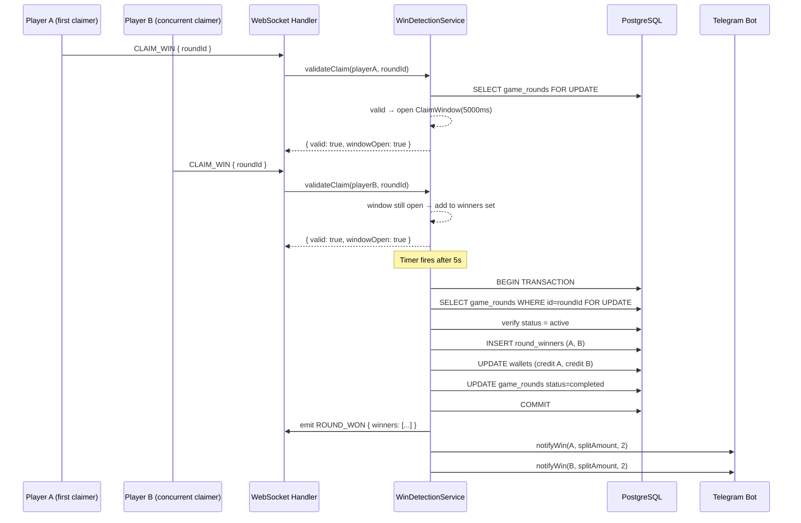

# Design Document: Multi-Winner Prize Split

## Overview

This feature extends the Beteseb Bingo game round lifecycle to support multiple simultaneous winners.
Instead of awarding the full derash to the first valid claim, the system opens a short
**claim window** (default 5 s, configurable via `claim_window_ms` in Config) after the first
valid win claim arrives. When the window expires the service collects all verified winners,
splits the prize equally using floor division, and credits each winner atomically in a single
database transaction.

The change touches five layers:

1. **Database schema** — new `round_winners` relation replaces single-winner fields on `GameRound`.
2. **Win Detection Service** — claim-window timer, multi-winner collection, atomic distribution.
3. **WebSocket layer** — `ROUND_WON` payload extended with a `winners` array.
4. **Telegram notifications** — per-winner message shows the individual split amount.
5. **Admin panel & Mini-app** — display all winners and split amounts.

---

## Architecture



### Key Design Decisions

**In-memory claim window with DB-level lock on distribution**
The claim window is held in a `Map<roundId, ClaimWindowState>` inside the
`WinDetectionService` module. This is acceptable because the existing architecture is
single-process (one Node.js instance). The map stores the timer handle, the winner set, and
a "closing" flag so concurrent timer callbacks cannot double-distribute.

On timer expiry the service acquires a `SELECT … FOR UPDATE` row-level lock on `game_rounds`
and re-checks `status === 'active'` before committing any credits. This is the same pattern
already used in `game-round.service.ts` for the `join` flow.

**Remainder goes to lexicographically smallest player ID**
Player IDs are UUIDs (strings). Lexicographic ordering on UUID strings is deterministic and
requires no extra data. This matches the requirement's specification exactly.

**Backward-compatible `winner_player_id` field**
The existing `GameRound.winner_player_id` column is retained and populated with the
lexicographically smallest winner ID so that any legacy queries (history, referral commission
triggers) continue to work without modification.

---

## Components and Interfaces

### 1. ClaimWindowState (in-memory, WinDetectionService)

```typescript
interface ClaimWindowState {
  timer: NodeJS.Timeout;
  winners: Map<string, { cartelaNumber: number }>; // playerId → winning cartela
  closing: boolean; // true once the distribution transaction has started
}

// Module-level map — one entry per active claim window
const claimWindows = new Map<string, ClaimWindowState>();
```

### 2. WinDetectionService — updated public API

```typescript
// No change to the external signature; internal behaviour changes significantly.
validateClaim(playerId: string, roundId: string): Promise<{ valid: boolean; reason?: string }>
```

The method now:
1. Checks for an existing claim window for `roundId`.
2. If none exists: validates the claim, opens a new window if valid.
3. If window is open: validates and adds to the winner set (or rejects if already claimed).
4. If window is closing/closed: rejects with `CLAIM_WINDOW_CLOSED`.

### 3. distributeWinnings (new private helper)

```typescript
async function distributeWinnings(roundId: string, winners: Map<string, { cartelaNumber: number }>): Promise<void>
```

Runs inside a single `prisma.$transaction`. Steps:

1. `SELECT … FOR UPDATE` on `game_rounds`.
2. Assert `status === 'active'`; abort if not.
3. Compute `splitAmount = Math.floor(derash / winners.size)`.
4. Find remainder receiver = lexicographically smallest `playerId`.
5. `INSERT` into `round_winners` for each winner with their `split_amount`.
6. `UPDATE wallets` (credit) for each winner.
7. `INSERT transactions` (type `game_win`) for each credit.
8. `UPDATE game_rounds` → `status=completed`, `ended_at=now()`, `winner_player_id=smallestId`.
9. Commit.

After commit (non-blocking):
- Emit `ROUND_WON` via the registered WebSocket callback.
- Send Telegram notifications per winner.
- Call `RoundScheduler.ensureRoundsExist()`.

### 4. RoundWinner DB model (new)

See Data Models section.

### 5. Updated WebSocket `ROUND_WON` payload

```typescript
interface RoundWonPayload {
  winners: Array<{
    playerId: string;
    username: string;
    cartelaNumber: number;
    amount: number;       // split amount credited to this winner
  }>;
  totalDerash: number;    // full prize pool (sum of all split amounts)
  winnerCount: number;
}
```

### 6. Updated Telegram `notifyWin`

Adds optional parameters for multi-winner context:

```typescript
notifyWin(playerId: string, amount: number, totalWinners?: number): Promise<void>
```

When `totalWinners > 1`, the message reads:
> 🏆 You won a shared prize! 3 players won this round.
> 💰 Your share: ETB 333.33 has been credited to your Main Wallet.

### 7. Admin API — `GET /api/admin/rounds` extended response

Each round item gains:

```typescript
winners?: Array<{
  playerId: string;
  username: string;
  cartelaNumber: number;
  splitAmount: number;
}>;
```

### 8. Config — `claim_window_ms`

Read via `prisma.config.findUnique({ where: { key: 'claim_window_ms' } })` inside
`validateClaim`. Falls back to `5000` when absent or non-numeric.

---

## Data Models

### New model: `RoundWinner`

```prisma
model RoundWinner {
  id             String    @id @default(uuid())
  round_id       String
  player_id      String
  cartela_number Int
  split_amount   Decimal   @db.Decimal(14, 2)
  created_at     DateTime  @default(now())

  round  GameRound @relation(fields: [round_id], references: [id])
  player Player    @relation(fields: [player_id], references: [id])

  @@unique([round_id, player_id])
  @@index([round_id])
  @@map("round_winners")
}
```

### Changes to `GameRound`

```prisma
// Add relation (no column change):
round_winners RoundWinner[]

// Existing columns are RETAINED (backward compat):
winner_player_id     String?   // set to lex-smallest winner ID
winner_cartela_number Int?     // set to that winner's cartela
```

### Changes to `Player`

```prisma
// Add back-relation only:
round_wins RoundWinner[]

// Remove existing back-relation that points directly to GameRound:
// won_rounds GameRound[]   ← replaced by round_wins RoundWinner[]
```

The existing `won_rounds` relation on `Player` (pointing at `GameRound.winner_player_id`) is
**removed** from the Prisma schema because `winner_player_id` now serves only as a
backward-compatibility field and should not carry business meaning going forward. All winner
queries use `round_winners`.

### Migration summary

1. Create `round_winners` table.
2. Add `round_winners` relation to `GameRound` and `Player`.
3. Remove `Player.won_rounds` relation field (schema-only change; column `winner_player_id`
   on `game_rounds` stays).
4. Add `claim_window_ms` seed row to `config` table (value `"5000"`).

---

## Correctness Properties

*A property is a characteristic or behavior that should hold true across all valid executions of a system — essentially, a formal statement about what the system should do. Properties serve as the bridge between human-readable specifications and machine-verifiable correctness guarantees.*

### Property 1: Claim window opens and accepts concurrent valid claims

*For any* active game round and any two distinct players each holding a cartela with a complete bingo line, submitting the first player's valid claim should open a claim window, and the second player's valid claim submitted while that window is open should also be accepted (not rejected).

**Validates: Requirements 1.1, 1.2**

---

### Property 2: Duplicate claims from the same player are rejected

*For any* active game round and any player who has already submitted a valid win claim within the open claim window, a second win claim from that same player should be rejected with a reason code of `DUPLICATE_CLAIM`.

**Validates: Requirements 1.3**

---

### Property 3: Claims after window expiry are rejected

*For any* game round whose claim window has closed (timer expired and distribution completed), any subsequent win claim attempt shall be rejected with reason code `CLAIM_WINDOW_CLOSED`.

**Validates: Requirements 1.4**

---

### Property 4: Claim window duration is driven by config with a 5000 ms fallback

*For any* possible state of the `claim_window_ms` Config key (present with a valid integer, present with a non-numeric value, or absent), the effective window duration used by `WinDetectionService` shall equal the stored integer value when valid, and 5000 when absent or non-numeric.

**Validates: Requirements 1.5, 8.4**

---

### Property 5: Watching players' claims are rejected

*For any* game round and any player whose `RoundEntry.is_watching` is `true`, submitting a win claim shall be rejected with reason code `ENTRY_NOT_FOUND` and no wallet balance shall change.

**Validates: Requirements 2.1**

---

### Property 6: Claims without a winning bingo line are rejected

*For any* active game round, any player with a non-watching entry, and any set of called numbers that does not complete a bingo line on any of that player's cartelas, the win claim shall be rejected with reason code `NO_WINNING_LINE` and no wallet balance shall change.

**Validates: Requirements 2.2**

---

### Property 7: Invalid claims never modify wallet balances

*For any* win claim that fails validation for any reason (watching player, no winning line, duplicate claim, expired window, round not active), the main wallet balance of the claiming player shall be identical before and after the claim is processed.

**Validates: Requirements 2.3, 3.4, 9.4**

---

### Property 8: Independent claim validation within the same window

*For any* claim window containing both a valid and an invalid claim from different players, rejecting the invalid claim shall not affect the acceptance of the valid claim; the valid claim must appear in the winners set regardless of processing order.

**Validates: Requirements 2.4**

---

### Property 9: Split amount calculation correctness

*For any* prize pool amount (derash) and any number of verified winners (winner_count ≥ 1), each winner's credited amount shall equal `Math.floor(derash / winner_count)`, except the winner with the lexicographically smallest player ID who shall receive `Math.floor(derash / winner_count) + (derash % winner_count)`, and the sum of all credited amounts shall equal derash exactly.

**Validates: Requirements 3.1, 3.2, 3.3**

---

### Property 10: Remainder and winner_player_id go to lexicographically smallest player ID

*For any* set of winner player IDs (one or many), after prize distribution:
- `GameRound.winner_player_id` shall equal the lexicographically smallest player ID in the winner set.
- The `RoundWinner` record for that player shall have `split_amount = Math.floor(derash / count) + remainder`.

**Validates: Requirements 3.3, 4.4**

---

### Property 11: Round status and ended_at are updated on distribution

*For any* game round for which prize distribution completes successfully, the round's `status` shall be `completed` and `ended_at` shall be set to a non-null timestamp.

**Validates: Requirements 3.5**

---

### Property 12: Winner records are persisted for every verified winner

*For any* set of N verified winners in a round, after prize distribution there shall be exactly N rows in `round_winners` for that round, each containing the correct `player_id`, `cartela_number`, and `split_amount`.

**Validates: Requirements 4.1, 4.2**

---

### Property 13: Telegram notifications are sent per winner with correct amounts

*For any* set of N winners after distribution, `notifyWin` shall be called exactly N times, each call with the corresponding winner's player ID, their individual split amount, and the total winner count. A failure in any notification call shall not alter any already-committed wallet balance.

**Validates: Requirements 5.2, 5.3**

---

### Property 14: Distribution is aborted when round is no longer active

*For any* game round that has its status changed to something other than `active` between the time a claim window opens and the time the distribution timer fires, the distribution shall be a no-op: no `round_winners` rows are inserted and no wallet balances change.

**Validates: Requirements 9.2, 9.3**

---

### Property 15: WebSocket winner payload survives a round-trip

*For any* completed game round with N winners, serializing the `ROUND_WON` WebSocket payload to JSON and then deserializing it shall produce an object where the `winners` array has length N and each element contains the correct `playerId`, `username`, `cartelaNumber`, and `amount` values.

**Validates: Requirements 6.4, 10.1, 10.2**

---

### Property 16: API winner amounts are numeric, not strings

*For any* completed game round returned by `GET /api/admin/rounds`, each entry in the `winners` array shall have `typeof amount === 'number'` (not a Prisma Decimal string).

**Validates: Requirements 10.3**

---

### Property 17: Admin API includes winners array for completed rounds

*For any* completed game round with N winners, `GET /api/admin/rounds` shall include a `winners` array of length N in that round's response object, each element containing at minimum `playerId`, `username`, `cartelaNumber`, and `splitAmount`.

**Validates: Requirements 7.1, 7.3, 7.4**

---

### Property 18: Claim window validation enforces 1000–30000 ms range

*For any* `claim_window_ms` value submitted via the admin settings API that is less than 1000 or greater than 30000, the service shall return a validation error and the Config table value shall remain unchanged.

**Validates: Requirements 8.3**

---

## Error Handling

### Win claim errors

| Reason code | Condition | HTTP/WS response |
|---|---|---|
| `ENTRY_NOT_FOUND` | Player has no non-watching entry in the round | `WIN_REJECTED` socket event |
| `ROUND_NOT_ACTIVE` | Round status ≠ active | `WIN_REJECTED` socket event |
| `CARTELA_NOT_FOUND` | No cartela definition found | `WIN_REJECTED` socket event |
| `NO_WINNING_LINE` | No bingo line complete on any of player's cartelas | `WIN_REJECTED` socket event |
| `DUPLICATE_CLAIM` | Player already has a valid claim in the open window | `WIN_REJECTED` socket event |
| `CLAIM_WINDOW_CLOSED` | Window has expired or round already completed | `WIN_REJECTED` socket event |
| `RATE_LIMITED` | Player exceeds 5 claims/min | `WIN_REJECTED` socket event |

### Distribution errors

- If the distribution transaction fails for any reason, the in-memory `ClaimWindowState` is cleaned up but the round remains in the state it was before the transaction was attempted. The error is logged with `[WinDetectionService] distribution error`.
- If `status ≠ active` at lock acquisition, distribution is silently aborted (the round was concurrently completed or cancelled elsewhere).

### Telegram notification errors

`notifyWin` errors are caught and logged with `[Bot] notifyWin error`. They do **not** propagate and cannot affect the prize credits, which are already committed in the DB by the time notifications are sent.

### Config fallback

If `claim_window_ms` is absent, zero, negative, or non-numeric, the value `5000` is used. No error is thrown.

---

## Testing Strategy

### Dual testing approach

Both unit tests and property-based tests are required; they are complementary.

- **Unit tests** cover specific examples, integration points, and error paths.
- **Property tests** verify universal invariants across randomly generated inputs.

The property-based testing library for this project is **fast-check** (already a common choice in the TypeScript ecosystem). Each property test runs a minimum of **100 iterations**.

Each property test is tagged with a comment in this format:
```
// Feature: multi-winner-prize-split, Property <N>: <property_text>
```

### Property tests (in `apps/backend/src/__tests__/properties/multi-winner-prize-split.property.test.ts`)

| Property | What to generate | What to assert |
|---|---|---|
| P1 — Window opens | Random active round, 2 players each with winning cartelas | Second claim accepted within window |
| P2 — Duplicate rejected | Random active round, 1 player claiming twice | Second claim returns DUPLICATE_CLAIM |
| P3 — Post-expiry rejected | After window fires | Any further claim returns CLAIM_WINDOW_CLOSED |
| P4 — Config fallback | Random config state (value present/absent/invalid) | Effective duration matches expected |
| P5 — Watcher rejected | Random round, random watching player | Returns ENTRY_NOT_FOUND, balance unchanged |
| P6 — No line rejected | Random grid + partial called set (no line complete) | Returns NO_WINNING_LINE, balance unchanged |
| P7 — Invalid leaves balance unchanged | Any invalid claim scenario | Balance before == balance after |
| P8 — Independent validation | One valid + one invalid claim in same window | Valid claim still in winner set |
| P9 — Split arithmetic | Random derash (Decimal) + random winner_count 1–20 | Each amount = floor, lex-smallest gets remainder, sum == derash |
| P10 — Lex-smallest gets remainder | Random set of UUID player IDs | winner_player_id == min of set, that winner's split_amount includes remainder |
| P11 — Status updated | Any distribution call | status=completed, ended_at ≠ null |
| P12 — Winner records created | Random N winners (1–10) | Exactly N rows in round_winners |
| P13 — Notifications per winner | Random N winners, stubbed bot | notifyWin called N times with correct args |
| P14 — Abort on non-active | Round pre-set to completed/cancelled | No credits, no round_winners rows |
| P15 — Payload round-trip | Random winners array | JSON.parse(JSON.stringify(payload)) is equivalent |
| P16 — Amounts are numeric | Random admin rounds API response | typeof amount === 'number' for all winners |
| P17 — Admin API winners array | Random completed rounds with winners | winners.length == actual winner count |
| P18 — Window range validation | Random integers outside [1000, 30000] | Validation error, Config unchanged |

### Unit tests

- Single-winner path: verify payout equals full derash (edge case of P9).
- `claim_window_ms` present and valid: verify exact window duration is used.
- Notification failure: stub `notifyWin` to throw, assert wallet balance still credited.
- `distributeWinnings` called with empty winners map: round status unchanged (defensive guard).

### Integration

The existing `win-detection.property.test.ts` file tests `checkWin` in isolation. The new property test file tests `validateClaim` end-to-end using a test database (or prisma mock). The split-arithmetic properties (P9, P10) are pure-function tests that do not need a database.
